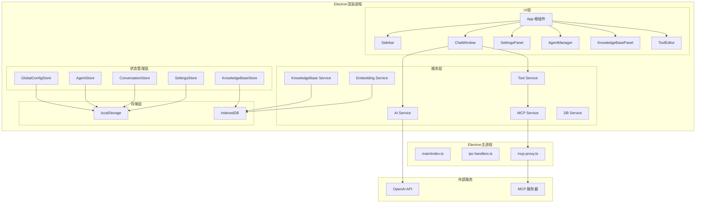
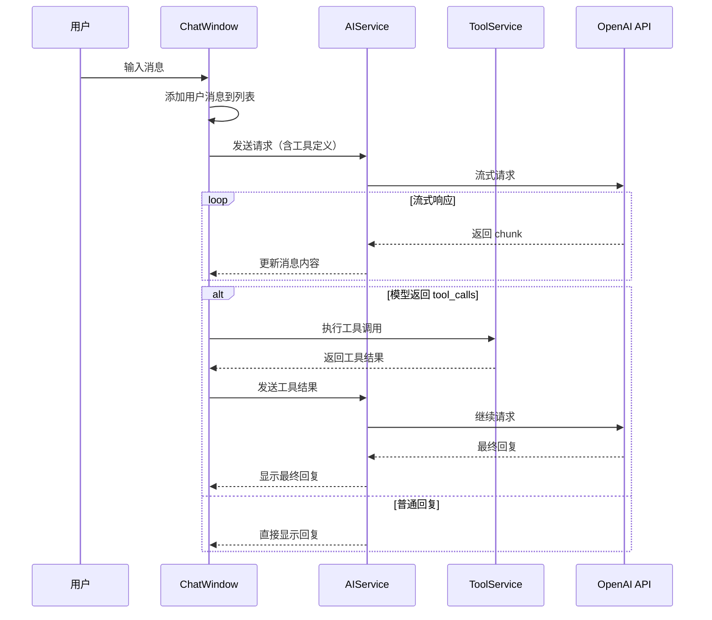
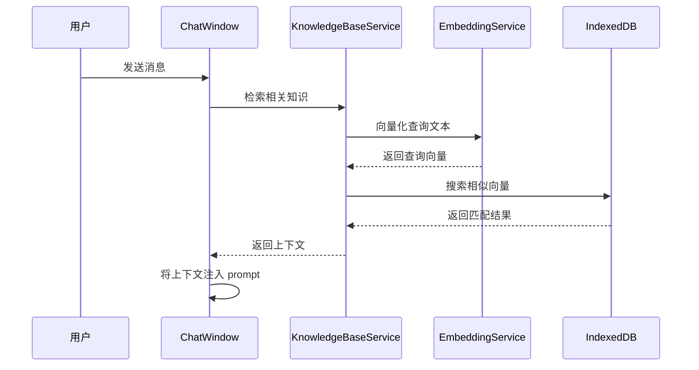

# Electron AI Tool - 架构设计文档

## 一、技术栈

| 类别 | 技术选型 |
|------|----------|
| 框架 | Electron + React + TypeScript |
| 构建工具 | electron-vite |
| 包管理器 | pnpm |
| 样式 | Tailwind CSS（暗色/亮色模式） |
| 状态管理 | Zustand |
| 持久化 | localStorage + IndexedDB |
| Markdown | marked + highlight.js |
| 公式 | katex |
| 向量化 | transformers.js |
| 图标 | lucide-react |
| ID 生成 | uuid |

## 二、项目目录结构

```
electron-aitool/
├── electron/
│   ├── main/
│   │   ├── index.ts              # 主进程入口
│   │   ├── ipc-handlers.ts       # IPC 处理器
│   │   └── mcp-proxy.ts          # MCP 代理（解决 CORS）
│   └── preload/
│       └── index.ts              # 预加载脚本
├── src/
│   ├── main.tsx                  # React 入口
│   ├── App.tsx                   # 根组件
│   ├── index.html                # HTML 入口
│   │
│   ├── types/                    # TypeScript 类型定义
│   │   ├── agent.ts
│   │   ├── message.ts
│   │   ├── conversation.ts
│   │   ├── tool.ts
│   │   ├── config.ts
│   │   └── knowledge-base.ts
│   │
│   ├── stores/                   # Zustand 状态管理
│   │   ├── global-config-store.ts
│   │   ├── agent-store.ts
│   │   ├── conversation-store.ts
│   │   ├── settings-store.ts
│   │   ├── knowledge-base-store.ts
│   │   └── middleware/
│   │       └── persist.ts        # localStorage 持久化中间件
│   │
│   ├── services/                 # 核心服务层
│   │   ├── ai-service.ts         # OpenAI API 流式请求
│   │   ├── tool-service.ts       # 工具定义与执行
│   │   ├── mcp-service.ts        # MCP 协议服务
│   │   ├── embedding-service.ts  # 文本向量化
│   │   ├── knowledge-base-service.ts  # 知识库管理
│   │   └── db-service.ts         # IndexedDB 服务
│   │
│   ├── components/               # UI 组件
│   │   ├── layout/
│   │   │   ├── App.tsx           # 根布局
│   │   │   ├── Sidebar.tsx       # 侧边栏
│   │   │   ├── MainArea.tsx      # 主区域
│   │   │   └── TopBar.tsx        # 顶部栏
│   │   │
│   │   ├── chat/
│   │   │   ├── ChatWindow.tsx    # 聊天窗口
│   │   │   ├── MessageItem.tsx   # 消息项
│   │   │   ├── MessageInput.tsx  # 输入框
│   │   │   ├── ThinkingSection.tsx  # 思考过程
│   │   │   ├── ToolCallDisplay.tsx  # 工具调用显示
│   │   │   └── MarkdownRenderer.tsx # Markdown 渲染
│   │   │
│   │   ├── conversation/
│   │   │   ├── ConversationList.tsx  # 对话列表
│   │   │   └── NewConversationButton.tsx
│   │   │
│   │   ├── settings/
│   │   │   ├── SettingsPanel.tsx     # 设置面板
│   │   │   ├── AgentManager.tsx      # Agent 管理
│   │   │   ├── KnowledgeBasePanel.tsx # 知识库面板
│   │   │   ├── ToolEditor.tsx        # 工具编辑器
│   │   │   └── MCPConfig.tsx         # MCP 配置
│   │   │
│   │   └── ui/                   # 通用 UI 组件
│   │       ├── Button.tsx
│   │       ├── Input.tsx
│   │       ├── Modal.tsx
│   │       ├── Dropdown.tsx
│   │       ├── Toggle.tsx
│   │       └── Tooltip.tsx
│   │
│   ├── hooks/                    # 自定义 Hooks
│   │   ├── use-chat.ts
│   │   ├── use-tools.ts
│   │   └── use-knowledge-base.ts
│   │
│   └── utils/                    # 工具函数
│       ├── markdown.ts
│       ├── tokenizer.ts
│       └── similarity.ts
│
├── electron.vite.config.ts       # electron-vite 配置
├── tailwind.config.js            # Tailwind 配置
├── tsconfig.json
├── package.json
└── pnpm-lock.yaml
```

## 三、系统架构图



## 四、数据模型

### Agent 模型
```typescript
interface Agent {
  id: string;
  name: string;
  description: string;
  avatar?: string;
  systemPrompt: string;
  // 可覆盖的全局配置
  modelId?: string;
  temperature?: number;
  maxTokens?: number;
  apiKey?: string;
  baseUrl?: string;
  // 绑定的工具和知识库
  tools: string[];        // 工具 ID 列表
  knowledgeBases: string[]; // 知识库 ID 列表
  createdAt: number;
  updatedAt: number;
}
```

### Message 模型
```typescript
interface Message {
  id: string;
  conversationId: string;
  role: 'user' | 'assistant' | 'system' | 'tool';
  content: string;
  reasoningContent?: string;  // 思考过程
  timestamp: number;
  tokenUsage?: {
    promptTokens: number;
    completionTokens: number;
    totalTokens: number;
  };
  toolCalls?: ToolCall[];
  toolCallId?: string;  // 工具返回结果时关联的调用 ID
  isStreaming?: boolean;
  isError?: boolean;
}

interface ToolCall {
  id: string;
  name: string;
  arguments: string;  // JSON 字符串
  result?: string;
  status: 'pending' | 'running' | 'completed' | 'error';
}
```

### Conversation 模型
```typescript
interface Conversation {
  id: string;
  title: string;
  agentId?: string;  // 关联的 Agent
  isPinned: boolean;
  createdAt: number;
  updatedAt: number;
  messageCount: number;
}
```

### Tool 模型
```typescript
interface Tool {
  id: string;
  name: string;
  description: string;
  parameters: object;  // JSON Schema
  isBuiltIn: boolean;
  isMCP: boolean;
  mcpServerId?: string;
  execute?: (params: any) => Promise<string>;
}
```

### GlobalConfig 模型
```typescript
interface GlobalConfig {
  apiKey: string;
  baseUrl: string;
  defaultModel: string;
  temperature: number;
  maxTokens: number;
  streamEnabled: boolean;
  mcpServers: MCPServerConfig[];
}

interface MCPServerConfig {
  id: string;
  name: string;
  url: string;
  enabled: boolean;
}
```

## 五、核心流程

### 1. 聊天消息流程



### 2. 知识库检索流程



## 六、主题系统

使用 Tailwind CSS 的 dark mode 实现：

```typescript
// 暗色模式类名前缀: dark:
// 示例:
<div className="bg-white dark:bg-gray-900 text-gray-900 dark:text-gray-100">
  <button className="bg-blue-500 hover:bg-blue-600 dark:bg-blue-600 dark:hover:bg-blue-700">
    按钮
  </button>
</div>
```

## 七、Electron IPC 通信

主进程暴露的 API：

```typescript
// preload/index.ts 暴露的 API
interface ElectronAPI {
  // MCP 代理
  mcp: {
    fetchTools: (serverUrl: string) => Promise<Tool[]>;
    callTool: (serverUrl: string, toolName: string, args: any) => Promise<any>;
  };
  // 窗口控制
  window: {
    minimize: () => void;
    maximize: () => void;
    close: () => void;
  };
  // 文件操作
  file: {
    openFile: () => Promise<string | null>;
    saveFile: (content: string) => Promise<boolean>;
  };
}
```
