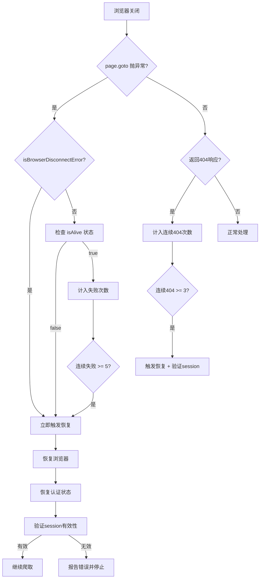

# 修复浏览器断开后404问题 - 第二轮方案

## 问题回顾

### 用户反馈（关键信息）
- 修复前：浏览器断开后**根本不会恢复**，也**不会发现**浏览器断开
- 修复前：一旦失败（浏览器关闭）就**全部404**
- 修复前：AI直接给出错误的结果
- 修复后：依旧如此，且触发该bug的时机**提前了**

### 第一轮修复的问题
我的第一轮修复包含三个改动，其中两个有问题：

| 改动 | 文件 | 是否有问题 |
|------|------|-----------|
| `saveAuthState()` / `restoreAuthState()` | browser-manager.ts | ✅ 正确 |
| `setDisconnectCallback()` + `saveAuthState()` 调用 | site-analyzer.ts | ✅ 正确 |
| 主动 `isAlive()` 健康检查（第195行） | crawler.ts | ❌ **有害** |
| `MAX_CONSECUTIVE_FAILURES` 5→2 | crawler.ts | ❌ **有害** |
| `navigateToWithRetry` 前的 `isAlive()` 检查 | crawler.ts | ⚠️ 可能有害 |

## 根本原因重新分析

### 错误检测链路分析

当浏览器被关闭时，错误流经以下路径：

```
浏览器关闭
  ↓
page.goto() 抛出异常
  ↓
navigateToWithRetry() 第一个 catch（不检查错误类型）
  ↓ 第二次尝试
page.goto() 再次抛出异常
  ↓
navigateToWithRetry() 第二个 catch → isBrowserDisconnectError()
  ↓ 如果不匹配 → 返回 null
crawlPage() 收到 null response
  ↓
跳过状态码检查，继续执行 page.title() / page.content()
  ↓ 这些也会抛异常
crawlPage() 的 catch 块 → isBrowserDisconnectError()
  ↓ 如果不匹配 → re-throw
主循环 catch → consecutiveFailures++
  ↓ 累积到 5 次
recoverBrowser() → tryReconnect() → 启动新浏览器（无session）
  ↓
所有后续页面返回 404（因为目标网站需要认证）
```

### 核心问题1：错误检测不充分

`isBrowserDisconnectError()` 的关键词列表：
```typescript
const keywords = [
  'Target closed', 'Browser closed', 'Browser has been closed',
  'Connection closed', 'Session closed', 'browser.newContext',
  'Target page, context or browser has been closed',
  'Navigation failed', 'net::ERR_', 'BROWSER_RECONNECTED'
]
```

**遗漏的常见 Playwright 断开错误**：
- `"Execution context was destroyed"` - 页面上下文被销毁
- `"Cannot find context with specified id"` - 上下文丢失
- `"Frame was detached"` - 帧被分离
- `"Execution context was destroyed, most likely because of a navigation"` - 导航导致上下文销毁
- `"Protocol error"` - 协议错误
- `"Connection refused"` - 连接被拒绝
- `"Socket closed"` - 套接字关闭
- `"ECONNREFUSED"` - 连接拒绝
- `"browserType.launch"` - 启动失败

### 核心问题2：404响应不触发错误检测

当 `navigateToWithRetry()` 返回 null（导航失败但非断开错误）时：
```typescript
const response = await this.navigateToWithRetry(page, url)
if (response && response.status() >= 400) {
  return null  // 404 时返回 null，不触发 catch
}
```

如果 `page.goto()` 返回了一个 404 响应（而不是抛异常），`crawlPage()` 返回 null，主循环不增加 `consecutiveFailures`。这意味着即使所有页面都返回 404，恢复机制也永远不会被触发。

### 核心问题3：第一轮修复为什么更糟

**主动 `isAlive()` 检查的问题**：
```typescript
// 第193-208行：在每次爬取前检查浏览器是否存活
if (!this.browserManager.isAlive()) {
  const recovered = await this.recoverBrowser()
  // ...
}
```

问题：
1. `isAlive()` = `this._isAlive && !!this.browser?.isConnected()`
2. 在某些情况下（浏览器启动中、页面加载中），`isConnected()` 可能短暂返回 false
3. 这会导致**误判**：浏览器还活着，但被误认为断开了
4. 误判触发 `recoverBrowser()` → 启动新浏览器 → 丢失 session → 404

**阈值从5降到2的问题**：
- 正常爬取中偶尔会有1-2次失败（网络抖动、超时等）
- 阈值为2意味着仅2次失败就触发恢复
- 这大大增加了误触发的概率

## 正确的修复方案

### 策略：多层防御 + 精准检测



### 具体改动

#### 1. 回退有害改动（crawler.ts）

- **删除** 第193-208行的主动 `isAlive()` 健康检查
- **恢复** `MAX_CONSECUTIVE_FAILURES` 从 2 回到 5
- **删除** `navigateToWithRetry()` 中第464行的 `isAlive()` 预检查

#### 2. 扩展错误检测（crawler.ts - `isBrowserDisconnectError()`）

添加更多 Playwright 断开相关的错误关键词：
```typescript
private isBrowserDisconnectError(errorMsg: string): boolean {
  const keywords = [
    // 原有关键词
    'Target closed', 'Browser closed', 'Browser has been closed',
    'Connection closed', 'Session closed', 'browser.newContext',
    'Target page, context or browser has been closed',
    'Navigation failed', 'net::ERR_', 'BROWSER_RECONNECTED',
    // 新增：Playwright 常见断开错误
    'Execution context was destroyed',
    'Cannot find context with specified id',
    'Frame was detached',
    'Protocol error',
    'Connection refused',
    'Socket closed',
    'ECONNREFUSED',
    'browser has been closed',
    'target closed',
    'page has been closed',
    'context has been closed',
  ]
  return keywords.some((kw) => errorMsg.toLowerCase().includes(kw.toLowerCase()))
}
```

**关键改进**：使用大小写不敏感匹配（`toLowerCase()`），避免因大小写差异漏检。

#### 3. 增加连续404计数器（crawler.ts - 主循环）

在主循环中增加对 404 响应的追踪：
```typescript
let consecutive404s = 0
const MAX_CONSECUTIVE_404S = 3

// 在 crawlPage 返回 null 时（可能是404）：
if (sitePage) {
  consecutiveFailures = 0
  consecutive404s = 0
  // ... 正常处理
} else {
  // crawlPage 返回 null，可能是 404 或其他非致命错误
  consecutive404s++
  if (consecutive404s >= MAX_CONSECUTIVE_404S) {
    // 连续多个页面返回 null，可能是 session 丢失
    const recovered = await this.recoverBrowser()
    if (!recovered) {
      // 停止
      break
    }
    consecutive404s = 0
  }
}
```

#### 4. 改进 `navigateToWithRetry()` 错误处理

在第一个 catch 中也检查断开错误，避免无意义的第二次尝试：
```typescript
private async navigateToWithRetry(page: Page, url: string): Promise<Response | null> {
  try {
    const response = await page.goto(url, { waitUntil: 'domcontentloaded', timeout: 15000 })
    return response
  } catch (e1) {
    const errMsg1 = e1 instanceof Error ? e1.message : String(e1)
    if (this.isBrowserDisconnectError(errMsg1)) {
      throw e1  // 断开错误直接抛出，不做第二次尝试
    }
    try {
      const response = await page.goto(url, { waitUntil: 'load', timeout: 20000 })
      return response
    } catch (e2) {
      const errMsg2 = e2 instanceof Error ? e2.message : String(e2)
      if (this.isBrowserDisconnectError(errMsg2)) {
        throw e2
      }
      return null
    }
  }
}
```

#### 5. 改进 `crawlPage()` 中的断开检测

在 `crawlPage()` 中，当 `navigateToWithRetry()` 返回 null 时，额外检查浏览器状态：
```typescript
const response = await this.navigateToWithRetry(page, url)
if (response && response.status() >= 400) {
  return null
}
// 如果导航失败（返回null）且浏览器已断开，触发恢复
if (!response && !this.browserManager.isAlive()) {
  throw new Error('Browser has been closed after navigation failure')
}
```

#### 6. 保留正确的修改

- **browser-manager.ts**：保留 `saveAuthState()`、`restoreAuthState()`、`tryReconnect()` 中的恢复逻辑
- **site-analyzer.ts**：保留 `setDisconnectCallback()` 调用、`saveAuthState()` 调用

#### 7. 添加关键日志

将所有被注释掉的 `console.log` / `console.warn` / `console.error` 取消注释，以便调试：
- 浏览器断开事件
- 恢复尝试和结果
- 错误消息内容（帮助未来调整关键词列表）
- 连续失败/404计数

### 改动文件清单

| 文件 | 改动类型 | 说明 |
|------|---------|------|
| `crawler.ts` | 回退 + 重写 | 删除有害改动，增加404计数，扩展错误检测 |
| `browser-manager.ts` | 保留 | 不改动，保留 saveAuthState/restoreAuthState |
| `site-analyzer.ts` | 保留 | 不改动，保留 setDisconnectCallback/saveAuthState |

### 风险评估

| 风险 | 概率 | 影响 | 缓解措施 |
|------|------|------|---------|
| 关键词列表仍不完整 | 中 | 中 | 添加日志记录未匹配的错误消息 |
| 连续404阈值不合适 | 低 | 低 | 3次是比较保守的阈值 |
| 恢复后session仍无效 | 中 | 中 | 在恢复后验证session有效性 |
| 大小写不敏感匹配误报 | 低 | 低 | 关键词都是特定的错误消息片段 |
