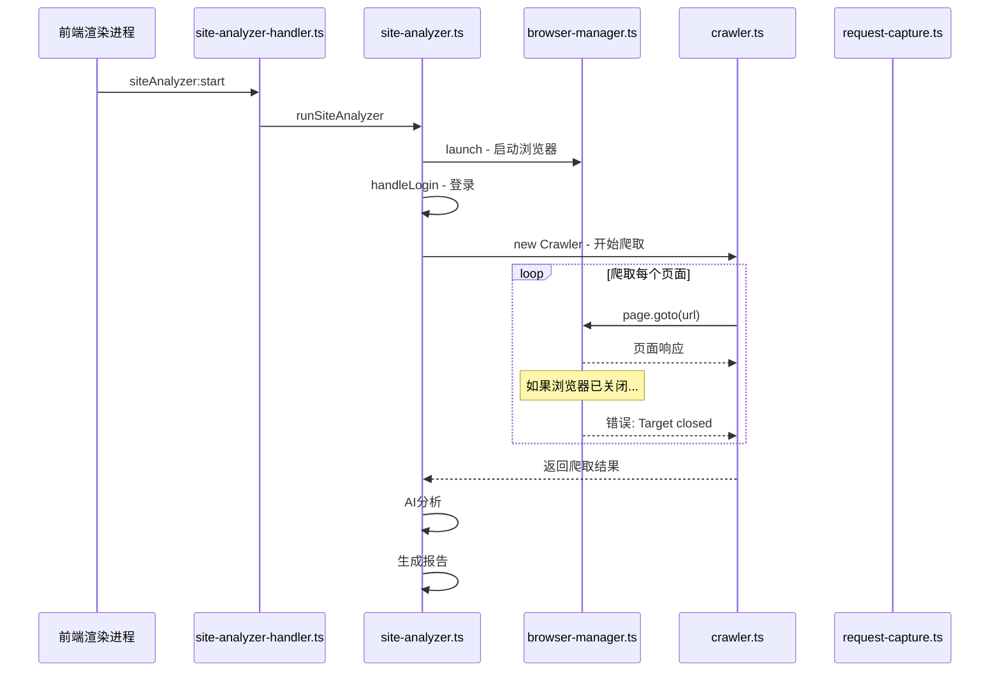

# 网站分析器"浏览器断开后全404"Bug 深度分析与修复方案

## 一、问题描述

网站分析功能在爬取过程中，如果用户关闭了浏览器窗口（或浏览器崩溃），后续所有页面请求都会返回404，导致分析彻底失败。该bug已修复几轮但依旧存在。

## 二、架构概览



## 三、根本原因分析（共发现6个关键问题）

### 根因 #1：浏览器重连后丢失登录态（核心问题）

**文件**: [`browser-manager.ts`](electron/main/site-analyzer/browser-manager.ts:36) 的 [`tryReconnect()`](electron/main/site-analyzer/browser-manager.ts:36)

当浏览器断开后，`tryReconnect()` 会创建一个**全新的浏览器实例和上下文**：

```typescript
// 当前代码（第42-49行）
this.pages.clear()
this.context = null
this.browser = null
this._isAlive = false
await this.launch(this._launchConfig)  // 全新启动，无cookie/session
```

**问题**：新上下文没有任何认证信息（cookies/session/token），导致后续所有需要登录的页面请求返回404。

### 根因 #2：爬虫恢复流程未重新建立登录

**文件**: [`crawler.ts`](electron/main/site-analyzer/crawler.ts:293) 的 [`recoverBrowser()`](electron/main/site-analyzer/crawler.ts:293)

```typescript
// 当前代码（第303-318行）
const reconnected = await this.browserManager.tryReconnect()
if (!reconnected) return false
await this.recreateSharedPage()  // 只创建新页面，不恢复登录
return true
```

**问题**：恢复成功后只是创建了新页面，完全没有重新执行登录流程或恢复认证状态。

### 根因 #3：浏览器断开事件未被监听

**文件**: [`browser-manager.ts`](electron/main/site-analyzer/browser-manager.ts:83) 的断开事件处理

```typescript
// 当前代码（第83-89行）
this.browser.on('disconnected', () => {
    this._isAlive = false
    if (this.onBrowserDisconnected) {
        this.onBrowserDisconnected()  // 从没被设置过！
    }
})
```

**问题**：`setDisconnectCallback()` 从未被调用，所以浏览器断开时没有任何主动响应机制。系统只能被动地等到下一次操作失败才发现。

### 根因 #4：爬虫绕过了 BrowserManager 的重连检查

**文件**: [`crawler.ts`](electron/main/site-analyzer/crawler.ts:444) 的 [`navigateToWithRetry()`](electron/main/site-analyzer/crawler.ts:444)

```typescript
// 爬虫直接调用 page.goto()，绕过了 BrowserManager.navigateTo() 的 isAlive() 检查
const response = await page.goto(url, { waitUntil: 'domcontentloaded', timeout: 15000 })
```

**问题**：`BrowserManager.navigateTo()` 有完整的 `isAlive()` 检查和重连逻辑，但爬虫完全没使用它。

### 根因 #5：连续失败阈值过高，恢复太慢

**文件**: [`crawler.ts`](electron/main/site-analyzer/crawler.ts:138)

```typescript
const MAX_CONSECUTIVE_FAILURES = 5  // 需要连续5次失败才触发恢复
```

**问题**：浏览器断开后，需要等5个页面爬取全部失败后才开始恢复。每失败一次都会延迟 `crawlDelay`（默认1秒），加上每次 `navigateToWithRetry` 的超时（15-20秒），恢复前浪费大量时间。

### 根因 #6：恢复后未重新注册请求捕获的上下文

**文件**: [`crawler.ts`](electron/main/site-analyzer/crawler.ts:276) 的 [`recreateSharedPage()`](electron/main/site-analyzer/crawler.ts:276)

虽然 `recreateSharedPage()` 会调用 `requestCapture.startCapture()`，但如果浏览器上下文已完全重建，旧的页面引用已失效，可能导致请求捕获在新页面上工作不正常。

## 四、修复方案

### 修复 #1：保存和恢复认证状态（BrowserManager）

**改动文件**: [`browser-manager.ts`](electron/main/site-analyzer/browser-manager.ts)

1. 新增 `saveAuthState()` 方法，在登录成功后保存 cookies 和 storage
2. 新增 `restoreAuthState()` 方法，在重连后恢复认证状态
3. 修改 `tryReconnect()`，重连后自动恢复认证状态

```typescript
// 新增属性
private savedCookies: Array<import('playwright').Cookie> = []
private savedLocalStorage: Array<{ origin: string; items: Record<string, string> }> = []

// 新增方法
async saveAuthState(): Promise<void> {
    if (!this.context) return
    this.savedCookies = await this.context.cookies()
    // 保存 localStorage 需要在页面中执行
    // ...
}

async restoreAuthState(): Promise<void> {
    if (!this.context) return
    if (this.savedCookies.length > 0) {
        await this.context.addCookies(this.savedCookies)
    }
    // 恢复 localStorage ...
}

// 修改 tryReconnect
async tryReconnect(): Promise<boolean> {
    // ... 现有清理逻辑 ...
    await this.launch(this._launchConfig)
    await this.restoreAuthState()  // 新增：恢复认证
    return true
}
```

### 修复 #2：爬虫恢复时重新建立登录（site-analyzer.ts + crawler.ts）

**改动文件**: [`site-analyzer.ts`](electron/main/site-analyzer/site-analyzer.ts) 和 [`crawler.ts`](electron/main/site-analyzer/crawler.ts)

1. 在 [`runSiteAnalyzer()`](electron/main/site-analyzer/site-analyzer.ts:105) 登录成功后，调用 `browserManager.saveAuthState()`
2. 将 `config` 传递给 Crawler，使其能在恢复后重新执行登录
3. 修改 [`recoverBrowser()`](electron/main/site-analyzer/crawler.ts:293)，恢复后尝试重新登录

```typescript
// site-analyzer.ts - 登录成功后保存状态
const loginPage = await handleLogin(config, browserManager, taskState, onProgress)
await browserManager.saveAuthState()  // 新增

// crawler.ts - 恢复时重新登录
private async recoverBrowser(): Promise<boolean> {
    const reconnected = await this.browserManager.tryReconnect()
    if (!reconnected) return false
    // tryReconnect 内部已恢复 auth state
    await this.recreateSharedPage()
    return true
}
```

### 修复 #3：设置浏览器断开回调，主动触发恢复

**改动文件**: [`site-analyzer.ts`](electron/main/site-analyzer/site-analyzer.ts) 或 [`crawler.ts`](electron/main/site-analyzer/crawler.ts)

在创建 Crawler 之前，设置断开回调：

```typescript
// site-analyzer.ts
browserManager.setDisconnectCallback(() => {
    onProgress({
        taskId,
        type: 'error',
        message: '检测到浏览器断开，正在尝试恢复...',
        error: '浏览器断开'
    })
})
```

### 修复 #4：在每次爬取前检查浏览器存活状态

**改动文件**: [`crawler.ts`](electron/main/site-analyzer/crawler.ts) 的 [`crawl()`](electron/main/site-analyzer/crawler.ts:115)

在主循环中、调用 `crawlPage()` 之前，添加健康检查：

```typescript
// 在 crawl() 的 while 循环中，crawlPage 调用前
if (this.sharedPage && !this.browserManager.isAlive()) {
    const recovered = await this.recoverBrowser()
    if (!recovered) {
        // 无法恢复，停止爬取
        break
    }
}
```

### 修复 #5：降低连续失败阈值

**改动文件**: [`crawler.ts`](electron/main/site-analyzer/crawler.ts:138)

```typescript
// 从 5 降低到 2
const MAX_CONSECUTIVE_FAILURES = 2
```

### 修复 #6：统一导航逻辑

**改动文件**: [`crawler.ts`](electron/main/site-analyzer/crawler.ts) 的 [`navigateToWithRetry()`](electron/main/site-analyzer/crawler.ts:444)

在 `navigateToWithRetry` 中增加存活检查：

```typescript
private async navigateToWithRetry(page: Page, url: string): Promise<Response | null> {
    // 新增：导航前检查浏览器状态
    if (!this.browserManager.isAlive()) {
        throw new Error('Browser has been closed')
    }
    // ... 现有逻辑 ...
}
```

## 五、改动影响范围

| 文件 | 改动类型 | 影响 |
|------|---------|------|
| `browser-manager.ts` | 新增方法 + 修改重连逻辑 | 核心改动，影响浏览器生命周期管理 |
| `site-analyzer.ts` | 登录后保存状态 + 设置断开回调 | 小改动 |
| `crawler.ts` | 恢复流程 + 健康检查 + 阈值调整 | 核心改动，影响爬取稳定性 |

## 六、测试要点

1. **手动关闭浏览器**：爬取过程中关闭浏览器窗口，验证自动恢复并继续爬取
2. **登录态保持**：恢复后验证cookies/session是否正确恢复
3. **cookie/token登录模式**：验证cookie和token模式下的恢复
4. **手动登录模式**：验证手动登录模式下的恢复（此模式可能无法自动恢复登录，需要提示用户）
5. **连续恢复**：验证多次断开-恢复的稳定性
6. **正常流程不受影响**：验证没有浏览器断开时的正常分析流程
