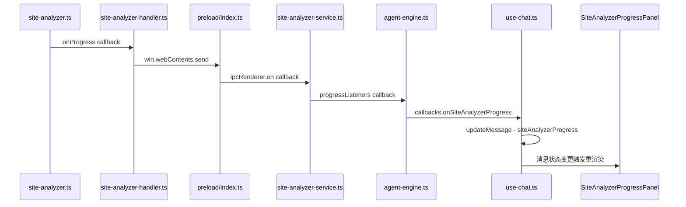

# 网站分析实时进度面板实施方案

## 问题描述

网站分析过程中，进度事件已经从主进程传到了 `agent-engine.ts`，但被静默收集到 `progressMessages` 数组中（仅在分析完成后作为工具结果返回）。用户在分析期间只能看到通用的"执行中"旋转图标，无法感知AI的工作进度，导致用户以为应用卡死而进行误操作。

## 目标

在聊天窗口的 ToolCallDisplay **上方**新增一个**实时进度面板**（`SiteAnalyzerProgressPanel`），展示：
- 5阶段指示器（浏览器启动 → 登录 → 爬取 → AI分析 → 报告生成）
- 实时统计数据（已爬页面数、已发现API数）
- 当前正在处理的URL（带截断）
- 每个阶段的完成状态动画
- 进度面板在分析完成后自动收起

## 架构流程



## 数据流变更

### 1. 扩展 Message 类型 - `src/types/message.ts`

新增 `SiteAnalyzerLiveProgress` 接口和 `siteAnalyzerProgress` 字段：

```typescript
/** 网站分析实时进度 */
export interface SiteAnalyzerLiveProgress {
  phase: 'browser' | 'login' | 'crawling' | 'analyzing' | 'report' | 'completed' | 'error'
  message: string
  pagesCrawled?: number
  totalPages?: number
  apisFound?: number
  pagesAnalyzed?: number
  currentUrl?: string
  startTime: number
  error?: string
}
```

在 `Message` 接口中添加：
```typescript
siteAnalyzerProgress?: SiteAnalyzerLiveProgress
```

### 2. 扩展 AgentEngineCallbacks - `src/services/agent-engine.ts`

在 `AgentEngineCallbacks` 接口中新增：
```typescript
onSiteAnalyzerProgress?: (progress: SiteAnalyzerProgress) => void
```

### 3. 更新 agent-engine.ts 进度转发

在 `handleSiteAnalyzerStartTool` 函数中，修改进度监听器，实时转发进度：

```typescript
siteAnalyzerService.addProgressListener('agent-engine', (progress) => {
  progressMessages.push(progress.message)
  if (progress.reportHtml) capturedReportHtml = progress.reportHtml
  // 实时转发进度到UI层
  callbacks.onSiteAnalyzerProgress?.(progress)
})
```

### 4. 更新 use-chat.ts - 3处 runAgent 调用

在所有 `runAgent` 调用的 callbacks 中添加 `onSiteAnalyzerProgress` 处理：
- 第 151 行附近的 `sendMessageWithAgent`
- 第 637 行附近的普通消息处理
- 第 1045 行附近的另一处调用

进度事件类型到阶段的映射：
```typescript
function mapProgressTypeToPhase(type: string): SiteAnalyzerLiveProgress['phase'] {
  switch (type) {
    case 'started': return 'browser'
    case 'logging_in':
    case 'login_success':
    case 'login_failed': return 'login'
    case 'crawling':
    case 'page_crawled': return 'crawling'
    case 'analyzing':
    case 'ai_analyzing_page':
    case 'ai_analysis_done': return 'analyzing'
    case 'generating_report':
    case 'report_ready': return 'report'
    case 'completed': return 'completed'
    case 'error': return 'error'
    default: return 'crawling'
  }
}
```

### 5. 创建 SiteAnalyzerProgressPanel 组件

新建 `src/components/chat/SiteAnalyzerProgressPanel.tsx`

**视觉设计**：
- 渐变背景卡片，带毛玻璃效果
- 5个阶段的步骤条，当前阶段带脉冲动画
- 实时统计数字（页面数、API数）带数字滚动效果
- 当前URL显示（截断到50字符，带省略号）
- 完成阶段显示绿色勾选，错误阶段显示红色
- 使用 lucide-react 图标（Globe, LogIn, Search, Brain, FileText）

**阶段配置**：
| 阶段 | 图标 | 颜色 | 标签 |
|------|------|------|------|
| browser | Globe | blue | 启动浏览器 |
| login | LogIn | emerald | 登录验证 |
| crawling | Search | amber | 全站爬取 |
| analyzing | Brain | purple | AI分析 |
| report | FileText | indigo | 生成报告 |

### 6. 更新 MessageItem.tsx

在 ToolCallDisplay **上方**，当消息存在 `siteAnalyzerProgress` 且正在流式传输时，渲染进度面板：

```tsx
{/* 网站分析实时进度面板 */}
{message.siteAnalyzerProgress && message.isStreaming && (
  <SiteAnalyzerProgressPanel progress={message.siteAnalyzerProgress} />
)}
```

## 涉及文件

| 文件 | 操作 | 说明 |
|------|------|------|
| `src/types/message.ts` | 修改 | 添加 SiteAnalyzerLiveProgress 类型和 Message 字段 |
| `src/services/agent-engine.ts` | 修改 | 扩展回调接口 + 转发进度事件 |
| `src/hooks/use-chat.ts` | 修改 | 3处 runAgent 调用添加 onSiteAnalyzerProgress 处理 |
| `src/components/chat/SiteAnalyzerProgressPanel.tsx` | 新建 | 进度面板组件 |
| `src/components/chat/MessageItem.tsx` | 修改 | 渲染进度面板 |

## 注意事项

- 进度面板仅在 `isStreaming === true` 时显示，分析完成后自动消失
- ToolCallDisplay 保持不变，进度面板是额外的展示区域
- 需要处理分析被取消（cancelled）和错误（error）的状态
- 数字变化使用 CSS transition 实现平滑滚动效果
- 所有文本使用中文，与现有UI风格一致
